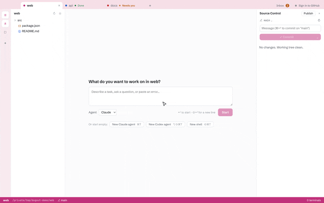

<p align="center"></p>

# Dugout

One desktop app for running and supervising coding agents across all your projects: coloured
projects, multiple real terminals per window, and a git panel for reviewing what the agents
changed.

<p align="center">
  <a href="https://github.com/prsvnkt/dugout/releases/latest"><b>Download for macOS</b></a>
</p>



Dugout runs each agent's own CLI in a real terminal, so any terminal-based agent works in a
shell pane. Claude Code and Codex are integrated today (live status, notifications, resumable
sessions, task tools); more agents will get the same support one by one.

## Getting started

Requires macOS and Node 22+, plus the CLI of each agent you want to run on your shell's PATH,
for example [Claude Code](https://docs.claude.com/en/docs/claude-code) or
[Codex](https://github.com/openai/codex).

```sh
npm install
npm run dev
```

## Install

### Download

Download `Dugout-<version>-arm64.dmg` from the
[latest release](https://github.com/prsvnkt/dugout/releases/latest), open it and drag Dugout to
Applications. Dugout needs a Mac with Apple silicon.

Dugout is not notarized by Apple yet, so the first launch is blocked with "Apple could not verify
Dugout…". Click **Done**, then open **System Settings → Privacy & Security** and click
**Open Anyway** next to the Dugout message. Alternatively, run once in Terminal:

```sh
xattr -dr com.apple.quarantine /Applications/Dugout.app
```

There are no automatic updates yet: download the new release and replace the app.

### Build from source

```sh
npm install
npm run dist
```

This builds `dist/Dugout-<version>-arm64.dmg` (and `dist/mac-arm64/Dugout.app`). A copy you
build yourself opens without the warning above. To update, pull and run `npm run dist` again.

`npm run dev` keeps its data in `~/Library/Application Support/Dugout Dev`, apart from the
installed app's `Dugout` folder, and shows as "Dugout Dev" in the Dock.

## Scripts

- `npm run dev` — run with hot reload
- `npm run check` — typecheck, lint, format check, unit tests
- `npm run icons` — regenerate `resources/icon.png` and `icon.icns` from the SVGs
- `npm run test:e2e` — end-to-end tests against the built app
- `npm run build` — production build
- `npm run dist` — package the macOS app into `dist/`
- `npm run test:e2e:packaged` — run the e2e tests against the packaged app (after `dist`)
- `npm run demo:gif` — record raw demo footage with sample projects and scripted agents into
  `out/demo/demo.gif`, for editing into the README demo (needs `brew install ffmpeg gifski`)

See [docs/decisions.md](docs/decisions.md) for design decisions and the roadmap, and
[.claude/CLAUDE.md](.claude/CLAUDE.md) for the codebase guide.

## Contributing

Contributions are welcome. See [CONTRIBUTING.md](CONTRIBUTING.md), and report security issues
privately as described in [SECURITY.md](SECURITY.md). Everyone taking part is expected to follow
the [Code of Conduct](CODE_OF_CONDUCT.md).

## License

[MIT](LICENSE)
